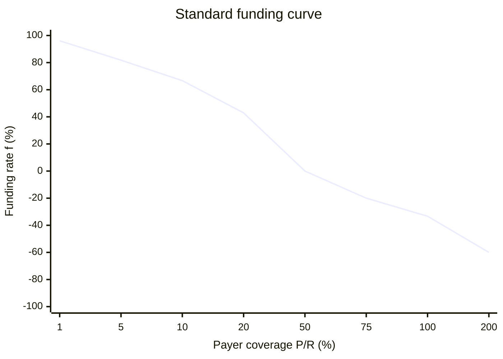

Funding is the market's capital-allocation signal. It moves value toward the side that is scarce relative to the funding-rate model's target.

## Signed funding rate

For the standard `NullV1ImbalanceFundingRateModel`, let:

- `R` be the prepared Receiver pool assets;
- `P` be the prepared Payer pool assets;
- `c` be the target Payer coverage ratio;
- `mu` be the model sensitivity.

```text
f = mu * (cR - P) / (cR + P)
```

`f` is a signed, WAD-scaled annual percentage rate. Its sign describes the flow from Receiver to Payer:

- `f > 0`: Receiver pays Payer.
- `f < 0`: Payer pays Receiver.
- `f = 0`: no funding transfer.

The standard deployment script uses `c = 0.5` and `mu = 1`. For that FRM deployment, the zero crossing is `P = 0.5R`, not `P = R`. Other enabled FRM addresses can use different immutable parameters or different logic, so read the selected FRM before quoting a rate.

Because `|(cR - P) / (cR + P)| <= 1`, the model guarantees `|f| <= mu` by construction. There is no separate runtime funding cap. If either pool is empty, the model explicitly returns zero.

## Read the funding curve

Divide the model by Receiver assets and define coverage `q = P / R`:

```text
f(q) = mu * (c - q) / (c + q)
```

This form makes the market behavior explicit:

- **Below target (`q < c`)** — Payer backing is scarce, so `f` is positive and Receiver pays Payer.
- **At target (`q = c`)** — the numerator is zero, so no funding moves.
- **Above target (`q > c`)** — Payer backing is abundant, so `f` is negative and Payer pays Receiver.
- **Near zero coverage** — the curve approaches `+mu` as `q` approaches zero from above.
- **Very high coverage** — the curve approaches `-mu` as `q` grows.

For the standard deployment, `c = 0.5` and `mu = 1`:



`c` moves the zero crossing horizontally. `mu` scales the curve vertically without changing the target. The curve becomes flatter as coverage rises:

```text
df/dq = -2 * mu * c / (c + q)^2
```

The chart starts at 1% coverage because the contract has a one-sided-market exception: if `P = 0` or `R = 0`, it returns `f = 0` and settlement applies no funding or price PnL.

## Funding notional and transfer

Funding accrues on Receiver assets in either direction:

```text
annual funding transfer = f * R
```

<Note>
  Positive `f` means Receiver pays Payer. Negative `f` means Payer pays
  Receiver.
</Note>

The whole Payer pool backs Receiver notional `R`. A Payer holder with position value `p` owns fraction `p / P` of that exposure:

```text
holder exposure notional = p * R / P
holder funding transfer  = holder exposure notional * f
```

`R / P` allocates the exposure and resulting transfer across Payer shares. It does not change the funding rate.

## Simplified worked examples

The following examples use the standard script parameters, show annualized values, ignore the settlement solvency cap and integer rounding, and round to the nearest whole unit or percentage point. Let `R = 1,000`, `c = 0.5`, and `mu = 1`:

| Payer pool `P` | Coverage `P/R` | Funding APR `f` | Annual transfer |
| -------------: | -------------: | --------------: | --------------- |
|             10 |             1% |          +96.1% | 961 R → P       |
|             50 |             5% |          +81.8% | 818 R → P       |
|            100 |            10% |          +66.7% | 667 R → P       |
|            200 |            20% |          +42.9% | 429 R → P       |
|            500 |            50% |              0% | 0               |
|            750 |            75% |          -20.0% | 200 P → R       |
|          1,000 |           100% |          -33.3% | 333 P → R       |
|          2,000 |           200% |          -60.0% | 600 P → R       |

At `P = 100`, for example:

```text
f = (500 - 100) / (500 + 100) = 2/3 = 66.7%
annual transfer = 66.7% * 1,000 = 667
```

The annualized transfer is calculated on Receiver notional and can exceed the current Payer pool. Actual settlement prorates the amount by elapsed time, nets funding with price PnL, and then limits the paying pool's debit to `max(pool assets - MIN_POOL_ASSETS, 0)`. The cap applies to the signed net transfer, not to the displayed funding rate.

## Reading the current rate

Settlement calls `fundingRate` after reconciliation and the collateral fee. Offchain callers should use `fundingRateView` with the same prepared `MarketState`; do not calculate a quote from stale stored pool balances.

`NullV1Lens.previewMarket` performs that preparation and calls `fundingRateView` for you. Use the Lens result for UI and indexer projections when available. `fundingRateView` is the read-only counterpart because an FRM is allowed to keep state in `fundingRate`.

## Collateral yield

Yield-bearing collateral is separate from funding. Rebases and donations change the market's external token balance and are reconciled pro rata across both pools. For appreciating vault-share collateral, each collateral token becomes redeemable for more underlying even if the market's token count does not change.

Ignoring price PnL and hedge costs, whole-pool annualized flows are:

```text
Receiver funding transfer = -f * R
Payer funding transfer    = +f * R
```

A Payer holder receives or pays fraction `p / P` of the Payer transfer and separately earns the collateral yield attributable to its pool shares. These expressions remain valid when `f` is negative: the funding leg simply changes direction.

## Payer hedging

Let a market maker own `p` collateral units of a Payer pool whose total assets are `P`. With Receiver assets `R` and oracle price `S` in quote units per base unit, the external long hedge is:

```text
h = (p / P) * (R / S) base units
H = hS = pR / P quote notional
```

In this simplified example, if `p = 10`, `P = 200`, `R = 1,000`, and `S = 25`:

```text
h = (10 / 200) * (1,000 / 25) = 2 base units
H = 2 * 25 = 50 quote units
```

The hedge is optional and external. Price settlement approximately preserves the hedge target because `R` and `S` move together while the Payer ownership fraction `p/P` remains unchanged. Deposits, withdrawals, funding drift, fees, and circuit-breaker events can still require rebalancing.

## Model calibration

For `NullV1ImbalanceFundingRateModel`, `c` sets the target Payer coverage where funding is zero. `mu` scales the curve without moving that zero crossing. Its constructor requires both values to be greater than zero and no greater than `1e18`. Both are immutable parameters of that FRM deployment; markets reference the FRM address rather than storing their own `c` or `mu`.

See [Market parameters](/markets/market-parameters) for deployment and onchain access details, and [Settlement](/developers/settlement) for settlement order.
