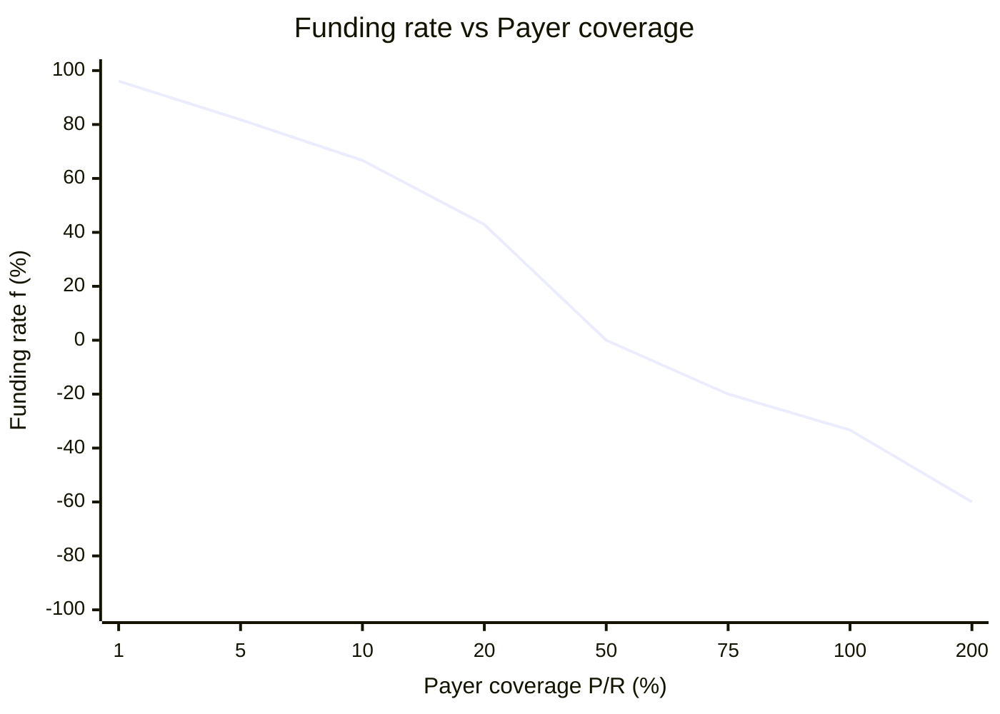

Null turns an oracle-tracked price return into two onchain pools. Receiver takes the tracked return. Payer provides the reserve and takes the other side.

Both sides deposit the market's collateral token. The protocol does not lend the tracked asset, create a margin account, or liquidate individual users. Settlement can only transfer collateral held by the market, subject to its minimum-pool floor.

## The idea in one minute

1. You deposit collateral into Receiver or Payer.
2. You receive transferable ERC-4626 shares in that pool.
3. On the next pool action, the market reads its oracle and funding-rate model.
4. The market nets price PnL and funding into a transfer between the pools.
5. Your shares represent a proportional claim on the collateral left in your pool.

If the tracked price rises, value normally moves from Payer to Receiver. If it falls, value normally moves from Receiver to Payer. Nobody is borrowing the tracked asset, and the market never needs to liquidate an account.

<Info>
You do not own or receive the tracked asset. A Receiver position does not include voting rights, dividends, redemption rights, or other ownership benefits unless the market's oracle return explicitly reflects them.
</Info>

## Receiver and Payer

### Receiver

Receiver takes the tracked price return against its pool assets. A 5% accepted price increase credits Receiver by about 5% of Receiver assets. A 5% decrease debits it by about 5%, before funding, fees, collateral changes, and settlement bounds.

### Payer

Payer supplies the reserve that backs Receiver's gains. It takes the opposite price transfer and earns or pays funding according to Payer coverage.

Let `R` be Receiver assets and `P` be Payer assets. The exposure-allocation ratio is:

```text
E = R / P
```

A smaller Payer pool produces a larger `E`, so each unit of Payer pool value represents a larger pro-rata share of Receiver exposure. The exposure itself remains matched one-for-one at the notional level.

## A simple example

Suppose `R = 1,000`, `P = 200`, and the accepted oracle price rises by 2%. The price transfer is about 2% of Receiver assets, or 20 collateral units:

```text
Receiver: 1,000 → 1,020
Payer:      200 →   180
```

Receiver gains 2%. The Payer pool backs the full 1,000-unit Receiver notional, so it pays the same 20-unit transfer. That transfer reduces the 200-unit Payer pool by 10%.

This simplified example excludes funding, fees, collateral changes, rounding, and settlement bounds.

## Funding and exposure notional

The funding-rate model encourages the market toward a target amount of Payer coverage:

- below target coverage, funding can flow from Receiver to Payer;
- above target coverage, funding can flow from Payer to Receiver; and
- at target coverage, the standard model's funding rate is zero.

Define Payer coverage as `q = P / R`. The standard model calculates:

```text
f = mu * (c - q) / (c + q)
```

`c` is the target coverage and `mu` controls the curve's maximum magnitude. The standard deployment uses `c = 0.5` and `mu = 1`:



Funding is positive below 50% coverage, zero at 50%, and negative above 50%. The curve is annualized and bounded by `-mu` and `+mu`. If either pool is empty, the implementation returns zero because a one-sided market settles neither funding nor price PnL.

If `f` is the signed market funding APR, it applies to Receiver exposure notional:

```text
annual funding transfer = R * f
```

Each Payer holder receives or pays its pro-rata share of that transfer. If a holder owns fraction `p / P` of the Payer pool, its exposure notional is `pR / P`, and its annualized funding transfer is `(pR / P) * f`.

Positive `f` means Receiver pays Payer. Negative `f` means Payer pays Receiver. `R / P` allocates Receiver exposure across Payer shares; it does not change `f`. Funding is variable, can reverse, and is not guaranteed yield.

For the normalized curve, model calibration, and worked transfer table, see [Funding and carry](/learn/funding-and-carry).

## Pooled positions

Depositing mints ERC-4626 shares. Your shares represent a percentage of the whole pool, not a bilateral trade or an account with a fixed entry price.

Pool shares are transferable, but that does not guarantee an active secondary market or a particular redemption value. Burning shares returns your proportional claim on the collateral currently allocated to the pool, after settlement and applicable fees.

If the market uses yield-bearing collateral, changes in that collateral can also affect both pools. Collateral yield is separate from funding and price PnL.

## What the market fixes

Each market is uniquely identified by three dependency addresses:

```text
(collateral, oracle, funding-rate model)
```

These dependencies and the two pool addresses are fixed for that market. Creating a market with a different collateral, oracle, or funding-rate model creates a different market.

The factory owner can enable funding-rate models for future markets, set capped entry, exit, and collateral fees, and collect accrued protocol fees. Review the current market and fee settings before entering.

## Settlement

Settlement is interaction-driven. Deposits, mints, withdrawals, and redemptions settle the market before continuing. The protocol does not expose a separate public keeper action that updates every block.

During settlement, the market reconciles collateral, accrues fees, reads the oracle and funding-rate model, nets price PnL with funding, and updates each pool's collateral balance. Existing share counts do not change. The collateral value represented by each share does.

If an accepted oracle move exceeds the time-adjusted circuit-breaker threshold, the market skips that update's price transfer and records the new price as its next baseline. Funding can still settle. The skipped price PnL is not deferred.

## Position lifecycle

<Steps>
  <Step title="Review the market">
    Check the tracked price, collateral, oracle, funding-rate model, pool sizes, current funding, fees, and circuit-breaker behavior.
  </Step>
  <Step title="Choose Receiver or Payer">
    Receiver takes the tracked return. Payer takes the opposite return with exposure scaled by `R / P`.
  </Step>
  <Step title="Mint shares">
    Deposit collateral into the selected pool and receive ERC-4626 shares.
  </Step>
  <Step title="Monitor the position">
    Pool sizes, funding, fees, collateral value, and oracle settlement can all change your position value.
  </Step>
  <Step title="Burn shares">
    Redeem pool shares for your proportional claim after the market settles.
  </Step>
</Steps>

<Warning>
Receiver and Payer can lose most of their pool value. The minimum-pool floor and circuit breaker constrain specific transfers; they do not guarantee fair pricing, liquidity, or capital protection.
</Warning>

Continue with [Position types](/private-beta/trading/position-types), [Smart contracts](/private-beta/about-null/smart-contracts), or the detailed [Funding and carry](/learn/funding-and-carry) guide.
